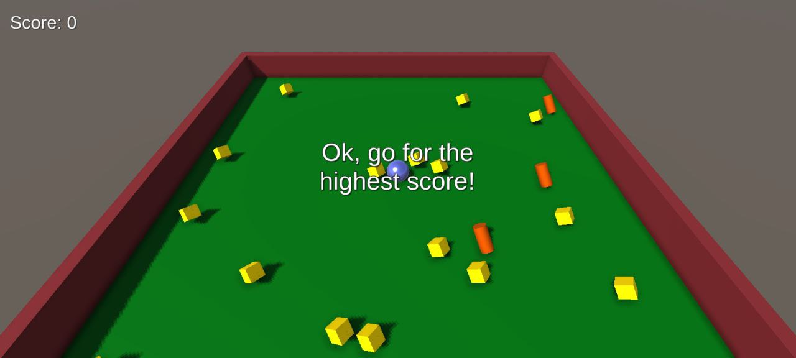
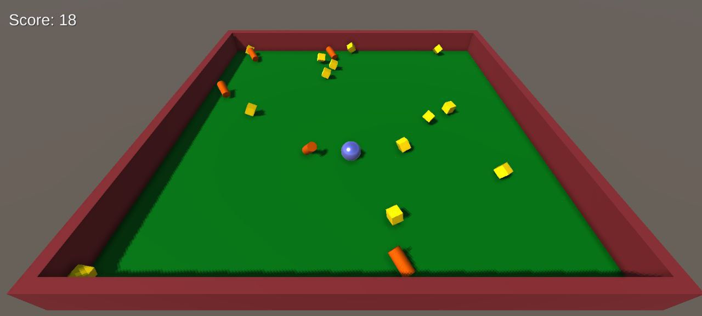

# Crazy Table!

This is a simple accelerometer based mobile game based on the [Roll-a-Ball Tutorial](https://learn.unity.com/project/roll-a-ball)

This game slowly introduces new game elements in five tutorial levels before setting the player loose in a rolling playground to get the highest score!

## Gameplay Shots

